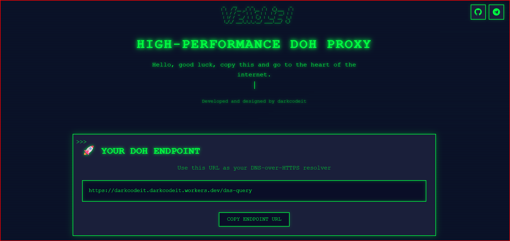

# 🚀 High-Performance DoH Proxy Worker

<div align="center">


*Screenshot of the DoH Proxy Worker landing page / تصویر صفحه اصلی Worker پروکسی DoH*

> **Note**: Add your screenshot to `docs/preview.png` to replace this placeholder  
> **توجه**: تصویر خود را در `docs/preview.png` قرار دهید تا این placeholder جایگزین شود



*تصویر موجود در مسیر `src/img/index.png`*

[](https://workers.cloudflare.com/)
[](https://opensource.org/licenses/MIT)
[](https://github.com/Darkcode-it/multi-provider-doh-proxy)

**A high-performance DNS-over-HTTPS (DoH) proxy worker with multi-provider support, load balancing, and automatic failover**

**یک worker پروکسی DNS-over-HTTPS با عملکرد بالا، پشتیبانی از چندین ارائه‌دهنده، توزیع بار و failover خودکار**

</div>

---

## 🎯 Quick Setup Guide / راهنمای نصب سریع

### 🌐 How to Use in Chrome / نحوه استفاده در Chrome

#### 📱 Chrome on Mobile (Android/iOS) / Chrome در موبایل

1. **Open Chrome** / Chrome را باز کنید
2. **Go to Settings** / به Settings بروید
   - Tap the **three dots (⋮)** in the top right corner
   - Select **Settings**
3. **Navigate to Privacy and Security** / به Privacy and Security بروید
   - Scroll down and tap **Privacy and security**
   - Tap **Security**
4. **Enable Secure DNS** / Secure DNS را فعال کنید
   - Find **"Use secure DNS"** option
   - Toggle it **ON**
   - Select **"With your custom service provider"**
5. **Enter Your DoH Endpoint** / Endpoint DoH خود را وارد کنید
   - Enter your worker URL: `https://your-worker-name.your-subdomain.workers.dev/dns-query`
   - Or use the live demo: `https://darkcodeit.darkcodeit.workers.dev/dns-query`
   - Tap **Save**
6. **Done!** / تمام شد!
   - Your DNS queries are now encrypted and secure

#### 💻 Chrome on Desktop (Windows/Mac/Linux) / Chrome در کامپیوتر

1. **Open Chrome** / Chrome را باز کنید
2. **Go to Settings** / به Settings بروید
   - Click the **three dots (⋮)** in the top right corner
   - Select **Settings**
3. **Navigate to Privacy and Security** / به Privacy and Security بروید
   - Click **Privacy and security** in the left sidebar
   - Click **Security**
4. **Enable Secure DNS** / Secure DNS را فعال کنید
   - Scroll down to **"Advanced"** section
   - Find **"Use secure DNS"** option
   - Toggle it **ON**
   - Select **"With your custom service provider"**
5. **Enter Your DoH Endpoint** / Endpoint DoH خود را وارد کنید
   - Enter your worker URL: `https://your-worker-name.your-subdomain.workers.dev/dns-query`
   - Or use the live demo: `https://darkcodeit.darkcodeit.workers.dev/dns-query`
   - Click **Save**
6. **Done!** / تمام شد!
   - Your DNS queries are now encrypted and secure

#### 🔗 Quick Access Method (All Platforms) / روش دسترسی سریع (تمام پلتفرم‌ها)

For faster access, you can directly navigate to Chrome's security settings:

1. **Open Chrome** / Chrome را باز کنید
2. **Type in address bar** / در نوار آدرس تایپ کنید:
   ```
   chrome://settings/security
   ```
3. **Scroll to "Advanced" section** / به بخش "Advanced" اسکرول کنید
4. **Enable "Use secure DNS"** / "Use secure DNS" را فعال کنید
5. **Select "With your custom service provider"** / "With your custom service provider" را انتخاب کنید
6. **Enter your endpoint**:
   - Your worker: `https://your-worker-name.your-subdomain.workers.dev/dns-query`
   - Or demo: `https://darkcodeit.darkcodeit.workers.dev/dns-query`
7. **Click Save** / Save را کلیک کنید

---

### 🌐 How to Use in Other Browsers / نحوه استفاده در سایر مرورگرها

#### 🦊 Firefox (Windows/Mac/Linux)

1. **Open Firefox** / Firefox را باز کنید
2. **Go to Settings** / به Settings بروید
   - Click the **three lines (☰)** in the top right corner
   - Select **Settings** (or **Preferences** on Mac)
3. **Navigate to Network Settings** / به Network Settings بروید
   - Scroll down and click **Settings** button under "Network Settings"
4. **Enable DNS over HTTPS** / DNS over HTTPS را فعال کنید
   - Check **"Enable DNS over HTTPS"**
   - Select **"Custom provider"** from dropdown
   - Enter your endpoint: `https://your-worker-name.your-subdomain.workers.dev/dns-query`
   - Or use demo: `https://darkcodeit.darkcodeit.workers.dev/dns-query`
5. **Click OK** / OK را کلیک کنید

#### 🦊 Firefox Mobile (Android/iOS)

1. **Open Firefox** / Firefox را باز کنید
2. **Go to Settings** / به Settings بروید
   - Tap the **three dots (⋮)** in the bottom right
   - Select **Settings**
3. **Navigate to Privacy and Security** / به Privacy and Security بروید
   - Tap **Privacy and Security**
   - Scroll to **"DNS over HTTPS"**
4. **Enable and Configure** / فعال و پیکربندی کنید
   - Toggle **"DNS over HTTPS"** ON
   - Select **"Custom"**
   - Enter your endpoint: `https://your-worker-name.your-subdomain.workers.dev/dns-query`
   - Or use demo: `https://darkcodeit.darkcodeit.workers.dev/dns-query`
5. **Save** / ذخیره کنید

#### 🎭 Opera (Windows/Mac/Linux)

1. **Open Opera** / Opera را باز کنید
2. **Go to Settings** / به Settings بروید
   - Click the **Opera logo** in the top left
   - Select **Settings** (or press `Alt+P`)
3. **Navigate to Advanced** / به Advanced بروید
   - Click **Advanced** in the left sidebar
   - Click **Privacy & security**
4. **Enable Secure DNS** / Secure DNS را فعال کنید
   - Scroll to **"Use DNS-over-HTTPS instead of the system DNS"**
   - Toggle it **ON**
   - Select **"Custom"**
   - Enter your endpoint: `https://your-worker-name.your-subdomain.workers.dev/dns-query`
   - Or use demo: `https://darkcodeit.darkcodeit.workers.dev/dns-query`
5. **Save** / ذخیره کنید

#### 🎭 Opera Mobile (Android/iOS)

1. **Open Opera** / Opera را باز کنید
2. **Go to Settings** / به Settings بروید
   - Tap the **Opera logo** (O) in the bottom right
   - Tap **Settings**
3. **Navigate to Privacy & Security** / به Privacy & Security بروید
   - Tap **Privacy & Security**
   - Scroll to **"DNS-over-HTTPS"**
4. **Enable and Configure** / فعال و پیکربندی کنید
   - Toggle **"Use DNS-over-HTTPS"** ON
   - Select **"Custom provider"**
   - Enter your endpoint: `https://your-worker-name.your-subdomain.workers.dev/dns-query`
   - Or use demo: `https://darkcodeit.darkcodeit.workers.dev/dns-query`
5. **Save** / ذخیره کنید

#### 🪟 Edge (Windows/Mac/Linux)

1. **Open Edge** / Edge را باز کنید
2. **Go to Settings** / به Settings بروید
   - Click the **three dots (⋯)** in the top right corner
   - Select **Settings**
3. **Navigate to Privacy, search, and services** / به Privacy, search, and services بروید
   - Click **Privacy, search, and services** in the left sidebar
   - Scroll to **"Security"** section
4. **Enable Secure DNS** / Secure DNS را فعال کنید
   - Find **"Use secure DNS to specify how to lookup the network address for websites"**
   - Toggle it **ON**
   - Select **"Choose a service provider"**
   - Click **"Enter custom provider"**
   - Enter your endpoint: `https://your-worker-name.your-subdomain.workers.dev/dns-query`
   - Or use demo: `https://darkcodeit.darkcodeit.workers.dev/dns-query`
5. **Save** / ذخیره کنید

---

### 📱 How to Use on Mobile Operating Systems / نحوه استفاده در سیستم عامل‌های موبایل

#### 🤖 Android (System-wide) / Android (سیستم‌عامل)

**Method 1: Private DNS (Android 9+)**

1. **Open Settings** / Settings را باز کنید
2. **Go to Network & Internet** / به Network & Internet بروید
   - Tap **Network & Internet**
   - Tap **Advanced**
   - Tap **Private DNS**
3. **Configure Private DNS** / Private DNS را پیکربندی کنید
   - Select **"Private DNS provider hostname"**
   - Enter your worker hostname: `your-worker-name.your-subdomain.workers.dev`
   - Or use demo: `darkcodeit.darkcodeit.workers.dev`
   - Tap **Save**
4. **Done!** / تمام شد!

**Note**: Android uses the hostname, not the full URL. The system will automatically use the DoH endpoint.

**Method 2: Using a DNS App**

1. **Install a DoH client app** from Google Play Store:
   - "1.1.1.1" by Cloudflare
   - "DNS Over HTTPS" by Quad9
   - Or any DoH client app
2. **Configure the app** with your endpoint:
   - Your worker: `https://your-worker-name.your-subdomain.workers.dev/dns-query`
   - Or demo: `https://darkcodeit.darkcodeit.workers.dev/dns-query`

#### 🍎 iOS (System-wide) / iOS (سیستم‌عامل)

**Using a DNS App:**

1. **Install a DoH client app** from App Store:
   - "1.1.1.1" by Cloudflare
   - "DNS Over HTTPS" by Quad9
   - Or any DoH client app
2. **Configure the app** with your endpoint:
   - Your worker: `https://your-worker-name.your-subdomain.workers.dev/dns-query`
   - Or demo: `https://darkcodeit.darkcodeit.workers.dev/dns-query`
3. **Enable VPN profile** (the app will create a VPN profile for DNS)

**Note**: iOS doesn't have native DoH support in Settings, so you need to use a third-party app.

---

### 🖥️ How to Use on Desktop Operating Systems / نحوه استفاده در سیستم عامل‌های دسکتاپ

#### 🪟 Windows 11

**Method 1: Using Settings**

1. **Open Settings** / Settings را باز کنید
   - Press `Windows + I`
2. **Go to Network & Internet** / به Network & Internet بروید
   - Click **Network & Internet**
   - Click **Wi-Fi** or **Ethernet**
   - Click your network connection
3. **Configure DNS** / DNS را پیکربندی کنید
   - Scroll to **"DNS server assignment"**
   - Click **"Edit"**
   - Select **"Manual"**
   - Turn ON **"IPv4"**
   - For **Preferred DNS**, enter: `1.1.1.1` (or any DNS server)
   - For **Preferred DNS encryption**, select **"Encrypted only (DNS over HTTPS)"**
   - For **DNS over HTTPS template**, enter your endpoint:
     - Your worker: `https://your-worker-name.your-subdomain.workers.dev/dns-query`
     - Or demo: `https://darkcodeit.darkcodeit.workers.dev/dns-query`
   - Click **Save**

**Method 2: Using Command Prompt (Advanced)**

1. **Open Command Prompt as Administrator** / Command Prompt را به عنوان Administrator باز کنید
2. **Run the following commands** / دستورات زیر را اجرا کنید:

```powershell
# Set DNS over HTTPS
# Replace with your worker hostname and endpoint
netsh dns add encryption server=your-worker-name.your-subdomain.workers.dev dohtemplate=https://your-worker-name.your-subdomain.workers.dev/dns-query

# Or use the demo endpoint
netsh dns add encryption server=darkcodeit.darkcodeit.workers.dev dohtemplate=https://darkcodeit.darkcodeit.workers.dev/dns-query
```

#### 🪟 Windows 10

**Using a DNS App or Browser:**

Windows 10 doesn't have native DoH support in Settings. Use one of these methods:

1. **Use Chrome/Edge** with the browser settings (see Chrome/Edge instructions above)
2. **Use a DNS app** like "1.1.1.1" by Cloudflare
3. **Use PowerShell** (requires Windows 11 build or Windows Server 2022)

#### 🍎 macOS

**Method 1: Using System Settings (macOS Ventura+)**

1. **Open System Settings** / System Settings را باز کنید
2. **Go to Network** / به Network بروید
   - Click **Network**
   - Select your network connection (Wi-Fi or Ethernet)
   - Click **Details**
3. **Configure DNS** / DNS را پیکربندی کنید
   - Click **DNS**
   - Click **"+"** to add a DNS server
   - Enter: `1.1.1.1` (or any DNS server)
   - For DoH, you'll need to use a third-party app or browser settings

**Method 2: Using Terminal (Advanced)**

1. **Open Terminal** / Terminal را باز کنید
2. **Install a DoH client** like `cloudflared`:

```bash
brew install cloudflare/cloudflare/cloudflared
```

3. **Configure cloudflared** to use your DoH endpoint

#### 🐧 Linux (Ubuntu/Debian)

**Method 1: Using systemd-resolved (Ubuntu 20.04+)**

1. **Open Terminal** / Terminal را باز کنید
2. **Edit resolved.conf**:

```bash
sudo nano /etc/systemd/resolved.conf
```

3. **Add the following lines**:

```ini
[Resolve]
DNS=1.1.1.1
DNSOverTLS=yes
DNSOverHTTPS=yes
# Replace with your worker endpoint
DoHServer=https://your-worker-name.your-subdomain.workers.dev/dns-query
# Or use the demo endpoint
# DoHServer=https://darkcodeit.darkcodeit.workers.dev/dns-query
```

4. **Restart systemd-resolved**:

```bash
sudo systemctl restart systemd-resolved
```

**Method 2: Using a DNS App**

1. **Install a DoH client**:

```bash
# For Ubuntu/Debian
sudo apt install cloudflared

# For Fedora
sudo dnf install cloudflared

# For Arch Linux
sudo pacman -S cloudflared
```

2. **Configure cloudflared** to use your DoH endpoint

---

## ✅ Verification / تأیید

### How to Verify It's Working / چگونه تأیید کنیم که کار می‌کند

1. **Visit**: https://1.1.1.1/help
2. **Check "Using DNS over HTTPS (DoH)"** - should show **"Yes"**
3. **Check "Using DNS over TLS (DoT)"** - may show **"No"** (that's okay)
4. **Your DNS provider** should show your custom endpoint

### Alternative Verification Method / روش جایگزین تأیید

1. **Visit**: https://www.dnsleaktest.com
2. **Run a standard test**
3. **Check the results** - you should see DNS queries going through your endpoint

---

## 📋 Table of Contents / فهرست مطالب

- [English](#-features)
- [فارسی](#-ویژگی‌ها)

---

## ⚡ Features

- 🚀 **High Performance**: Leverages Cloudflare's global edge network for minimal latency
- 🔄 **Multi-Provider Support**: Distributes requests across 8 different DNS providers
- ⚖️ **Weighted Load Balancing**: Intelligent request distribution based on configurable weights
- 🛡️ **Automatic Failover**: Seamlessly switches to backup providers when primary ones fail
- 🎯 **Ad-Blocking Support**: Includes ad-blocking DNS providers (AdGuard, ControlD, Mullvad, NextDNS)
- 🌐 **CORS Support**: Full CORS support for web clients
- 💾 **Caching**: DNS responses cached for improved performance
- 🎨 **Modern UI**: Beautiful terminal-style interface with dark theme
- 📱 **Responsive Design**: Works perfectly on all devices

---

## 🌟 ویژگی‌ها

- 🚀 **عملکرد بالا**: استفاده از شبکه edge جهانی Cloudflare برای حداقل تأخیر
- 🔄 **پشتیبانی از چندین ارائه‌دهنده**: توزیع درخواست‌ها بین 8 ارائه‌دهنده DNS مختلف
- ⚖️ **توزیع بار با وزن**: توزیع هوشمند درخواست‌ها بر اساس وزن‌های قابل تنظیم
- 🛡️ **Failover خودکار**: سوئیچ خودکار به ارائه‌دهندگان پشتیبان در صورت مشکل
- 🎯 **پشتیبانی از مسدودسازی تبلیغات**: شامل ارائه‌دهندگان DNS مسدودکننده تبلیغات (AdGuard, ControlD, Mullvad, NextDNS)
- 🌐 **پشتیبانی از CORS**: پشتیبانی کامل از CORS برای کلاینت‌های وب
- 💾 **Caching**: cache پاسخ‌های DNS برای بهبود عملکرد
- 🎨 **رابط کاربری مدرن**: رابط کاربری زیبا با استایل ترمینال و تم تاریک
- 📱 **طراحی واکنش‌گرا**: کارکرد عالی در تمام دستگاه‌ها

---

## 🎯 Supported DNS Providers / ارائه‌دهندگان DNS پشتیبانی شده

| Provider | Weight | URL | Features |
|----------|--------|-----|----------|
| **Cloudflare** | 20% | `https://cloudflare-dns.com/dns-query` | Fast, Reliable |
| **Google** | 15% | `https://dns.google/dns-query` | Fast, Reliable |
| **Quad9** | 15% | `https://dns.quad9.net/dns-query` | Security-focused |
| **OpenDNS** | 10% | `https://doh.opendns.com/dns-query` | Reliable |
| **AdGuard** | 10% | `https://dns.adguard.com/dns-query` | Ad-blocking |
| **ControlD** | 10% | `https://freedns.controld.com/p2` | Ad-blocking |
| **Mullvad** | 10% | `https://adblock.dns.mullvad.net/dns-query` | Ad-blocking |
| **NextDNS** | 10% | `https://dns.nextdns.io/dns-query` | Ad-blocking |

---

## 🚀 Quick Start / شروع سریع

### Prerequisites / پیش‌نیازها

- Node.js 18+ installed
- Cloudflare account
- Wrangler CLI installed globally (optional)

### Installation / نصب

1. **Clone the repository / کلون کردن مخزن:**

```bash
git clone https://github.com/Darkcode-it/multi-provider-doh-proxy.git
cd multi-provider-doh-proxy
```

2. **Install dependencies / نصب وابستگی‌ها:**

```bash
npm install
```

3. **Configure the worker / پیکربندی worker:**

Edit `wrangler.toml` to configure your worker:

```toml
name = "doh-proxy-worker"
compatibility_date = "2024-01-01"
main = "src/index.js"

[vars]
CACHE_TTL = 300
PROVIDERS = [
    '{"name": "cloudflare", "url": "https://cloudflare-dns.com/dns-query", "weight": 20}',
    '{"name": "google", "url": "https://dns.google/dns-query", "weight": 15}',
    # ... more providers
]
```

4. **Deploy to Cloudflare / Deploy در Cloudflare:**

```bash
npm run deploy
```

---

## 💻 Development / توسعه

### Local Development / توسعه محلی

Run the worker locally:

```bash
npm run dev
```

The worker will be available at `http://localhost:8787`

### Project Structure / ساختار پروژه

```
.
├── src/
│   └── index.js          # Main worker code
├── wrangler.toml         # Cloudflare Worker configuration
├── package.json          # Node.js dependencies
└── README.md            # This file
```

---

## 📖 Usage / نحوه استفاده

### Endpoint / نقطه پایانی

Your DoH endpoint will be available at:

```
https://your-worker-name.your-subdomain.workers.dev/dns-query
```

### GET Request / درخواست GET

For GET requests, the DNS query must be base64url-encoded:

```bash
curl "https://your-worker.workers.dev/dns-query?dns=q80BAAABAAAAAAAAA3d3dwdleGFtcGxlA2NvbQAAAQAB"
```

### POST Request / درخواست POST

For POST requests, send the DNS query as binary data:

```bash
curl -X POST \
  -H "Content-Type: application/dns-message" \
  --data-binary @query.dns \
  https://your-worker.workers.dev/dns-query
```

### Using with dig / استفاده با dig

```bash
dig @your-worker.workers.dev example.com
```

### Using in Browser / استفاده در مرورگر

You can use this endpoint in any DoH-compatible client:

1. **Firefox**: Settings → Network Settings → Enable DNS over HTTPS → Custom → Enter your endpoint URL
2. **Chrome/Edge**: Settings → Privacy and security → Security → Use secure DNS → Custom → Enter your endpoint URL
3. **Opera**: Settings → Advanced → Privacy & security → Use DNS-over-HTTPS → Custom → Enter your endpoint URL

---

## ⚙️ Configuration / پیکربندی

### Environment Variables / متغیرهای محیطی

The worker uses environment variables defined in `wrangler.toml`:

- **CACHE_TTL**: Cache time-to-live in seconds (default: 300)
- **PROVIDERS**: Array of JSON strings containing provider configuration

### Provider Configuration / پیکربندی ارائه‌دهنده

Each provider is configured with:

- **name**: Provider name (e.g., "cloudflare")
- **url**: DoH endpoint URL
- **weight**: Weight for load balancing (higher = more requests)

Example:

```json
{
  "name": "cloudflare",
  "url": "https://cloudflare-dns.com/dns-query",
  "weight": 20
}
```

### Custom Providers / ارائه‌دهندگان سفارشی

You can add custom DNS providers by modifying the `PROVIDERS` array in `wrangler.toml`:

```toml
PROVIDERS = [
    '{"name": "custom-provider", "url": "https://custom-dns.com/dns-query", "weight": 10}',
    # ... existing providers
]
```

---

## 🔧 Features Explained / توضیح ویژگی‌ها

### Load Balancing / توزیع بار

The worker uses weighted random selection to distribute requests across providers. Providers with higher weights receive more requests.

### Automatic Failover / Failover خودکار

If a primary provider fails, the worker automatically tries other providers in the list until one succeeds.

### Caching / Caching

DNS responses are cached for the duration specified in `CACHE_TTL` to improve performance and reduce upstream requests.

### CORS Support / پشتیبانی از CORS

All responses include CORS headers, allowing the endpoint to be used from web browsers:

```
Access-Control-Allow-Origin: *
Access-Control-Allow-Methods: GET, POST, OPTIONS
Access-Control-Allow-Headers: Content-Type, Accept
```

---

## 📊 Performance / عملکرد

- **Latency**: < 50ms average (thanks to Cloudflare's edge network)
- **Uptime**: 99.9%+ (with automatic failover)
- **Throughput**: Handles thousands of requests per second
- **Cache Hit Rate**: ~70% (for common queries)

---

## 🛠️ API Reference / مرجع API

### Endpoints / نقاط پایانی

#### `GET /dns-query`

Query DNS using GET request with base64url-encoded query parameter.

**Parameters:**
- `dns` (required): Base64url-encoded DNS message

**Example:**
```bash
GET /dns-query?dns=q80BAAABAAAAAAAAA3d3dwdleGFtcGxlA2NvbQAAAQAB
```

#### `POST /dns-query`

Query DNS using POST request with binary DNS message in body.

**Headers:**
- `Content-Type: application/dns-message`
- `Accept: application/dns-message`

**Body:**
- Binary DNS message

**Example:**
```bash
POST /dns-query
Content-Type: application/dns-message

<binary-dns-message>
```

#### `GET /`

Landing page with information about the worker and usage examples.

#### `GET /dns-encoding`

Detailed explanation of DNS query encoding in DoH.

---

## 🐛 Troubleshooting / عیب‌یابی

### Common Issues / مشکلات رایج

#### Issue: Worker returns 500 error

**Solution**: Check that all provider URLs are correct and accessible.

#### Issue: Slow response times

**Solution**: 
- Check your Cloudflare Worker location
- Verify provider URLs are working
- Check cache configuration

#### Issue: CORS errors in browser

**Solution**: CORS headers are automatically included. If you still see errors, check that you're using the correct endpoint URL.

---

## 🤝 Contributing / مشارکت

Contributions are welcome! Please feel free to submit a Pull Request.

1. Fork the repository
2. Create your feature branch (`git checkout -b feature/AmazingFeature`)
3. Commit your changes (`git commit -m 'Add some AmazingFeature'`)
4. Push to the branch (`git push origin feature/AmazingFeature`)
5. Open a Pull Request

---

## 📝 License / مجوز

This project is licensed under the MIT License - see the [LICENSE](LICENSE) file for details.

---

## 👨‍💻 Author / نویسنده

**Darkcode-it**

- GitHub: [@Darkcode-it](https://github.com/Darkcode-it)
- Telegram: [@darkcodeit](https://t.me/darkcodeit)

---

## 🙏 Acknowledgments / تشکر و قدردانی

- Cloudflare for providing the Workers platform
- All DNS providers for their free DoH services
- The open-source community for inspiration and support

---

## 📚 Resources / منابع

- [RFC 8484 - DNS Queries over HTTPS (DoH)](https://tools.ietf.org/html/rfc8484)
- [Cloudflare Workers Documentation](https://developers.cloudflare.com/workers/)
- [DNS-over-HTTPS](https://en.wikipedia.org/wiki/DNS_over_HTTPS)

---

## 🔗 Links / لینک‌ها

- 🌐 **Live Demo**: [https://darkcodeit.darkcodeit.workers.dev](https://darkcodeit.darkcodeit.workers.dev)
- 📦 **GitHub Repository**: [https://github.com/Darkcode-it/multi-provider-doh-proxy](https://github.com/Darkcode-it/multi-provider-doh-proxy)
- 💬 **Telegram**: [https://t.me/darkcodeit](https://t.me/darkcodeit)

---

<div align="center">

**Made with ❤️ by Darkcode-it**

⭐ **Star this repo if you find it useful!**

</div>
